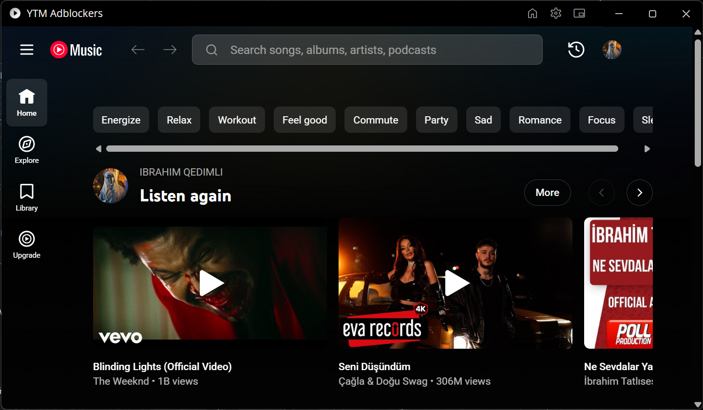

# YTM Adblockers
### YouTube Music Desktop App with Ad-Blocking & SponsorBlock



[![License][license-img]][license-url]
[![Release][release-img]][release-url]
[![Download][download-img]][download-url]

> **Note:** This project is a fork of [ytmdesktop/ytmdesktop](https://github.com/ytmdesktop/ytmdesktop) (GPL-3.0). All credit for the original application goes to the ytmdesktop team and contributors.

# ⬇️ Download
#### Windows
- **Setup (installer):** [YTM Adblockers Setup beta](https://github.com/elsenqedimli1234-dot/ytm-adblockers/releases)
- **Portable (no install):** [YTM Adblockers Portable beta](https://github.com/elsenqedimli1234-dot/ytm-adblockers/releases)

Download the latest release from the [Releases](https://github.com/elsenqedimli1234-dot/ytm-adblockers/releases) page.

# ✨ Features
- 🎵 Listen to YouTube Music in a dedicated desktop application
- 🛡️ **Built-in ad blocking** — updated URL filters
- Continue where you left off
- Custom CSS support
- Discord Rich Presence

Developing
To clone and run this repository you'll need [Git](https://git-scm.com) and [Node.js (v20)](https://nodejs.org/en/download/) (which comes with [npm](http://npmjs.com)) installed on your computer. From your command line:

```sh
# Clone this repository
git clone https://github.com/elsenqedimli1234-dot/ytm-adblockers.git
# Go into the directory
cd ytm-adblockers
```
##### And:
```sh
# If you do not have Yarn Installed / New to Node as a whole you can enable Yarn with:
corepack enable

# Install dependencies
yarn install
# Run the app
yarn start
```

# Building the Project
To build for your platform run `yarn make`. Building for Windows requires the electron build tools:

`npm i -g @electron/build-tools`

To package without making installers just run `yarn package`.

## License

This project is licensed under the [GNU GPL-3.0](LICENSE), inherited from the original ytmdesktop project.

## Credits

Based on [ytmdesktop/ytmdesktop](https://github.com/ytmdesktop/ytmdesktop) — a thank you to all the [original project contributors](https://github.com/ytmdesktop/ytmdesktop#contributors) for making this possible.

[license-img]: https://img.shields.io/badge/LICENSE-GPL--3.0--only-orange.svg?style=for-the-badge&logo=librarything
[license-url]: https://github.com/elsenqedimli1234-dot/ytm-adblockers/blob/master/LICENSE
[release-img]: https://img.shields.io/github/v/release/elsenqedimli1234-dot/ytm-adblockers.svg?style=for-the-badge&logo=flattr
[release-url]: https://github.com/elsenqedimli1234-dot/ytm-adblockers/releases
[download-img]: https://img.shields.io/github/downloads/elsenqedimli1234-dot/ytm-adblockers/total.svg?style=for-the-badge&logo=cloudsmith
[download-url]: https://github.com/elsenqedimli1234-dot/ytm-adblockers/releases/
